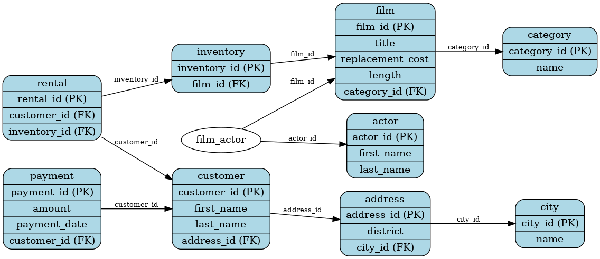
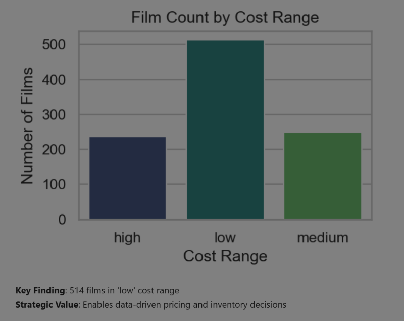
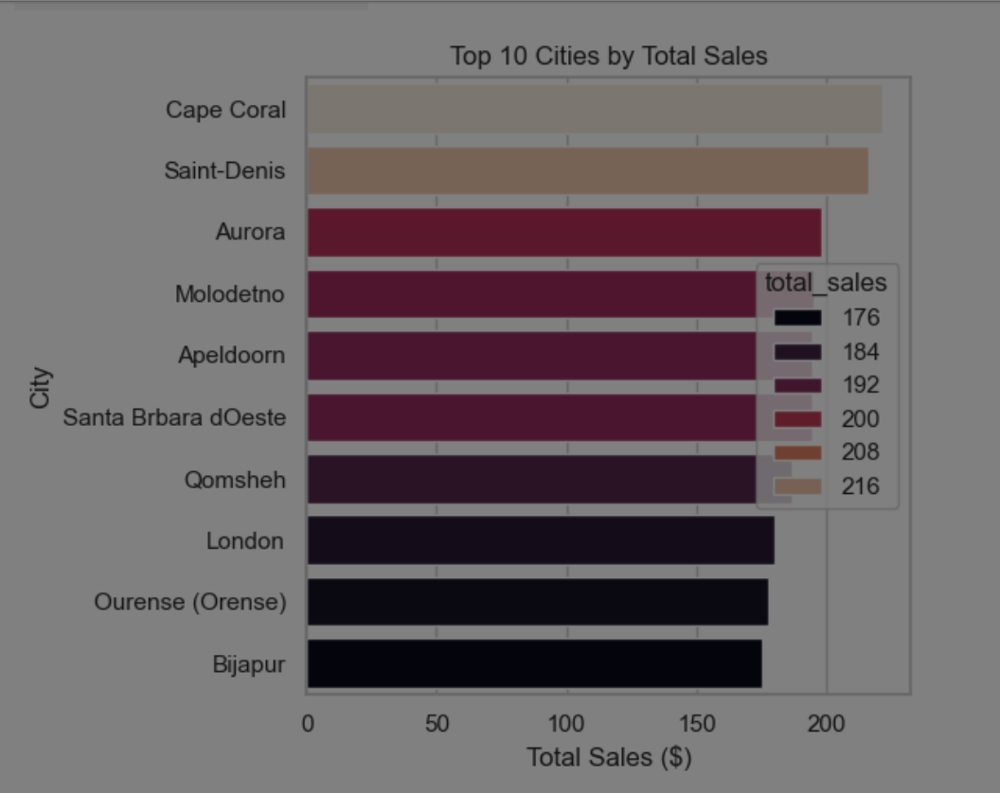

# 📊 SQL Business Analysis: Comprehensive DVD Rental Database Insights

## 🌟 Project Overview

This project showcases **advanced SQL expertise** by performing an in-depth analysis of a DVD rental database. By combining **complex SQL queries**, **data visualizations**, and **business insights**, this project highlights how data can drive strategic decision-making and operational excellence.

Through 14 progressively complex SQL queries, we uncover actionable insights into various aspects of the business, including inventory management, customer behavior, geographical sales trends, and staff performance. Each query is complemented by clear explanations and visualizations for a comprehensive understanding of the results.

---

## 📚 Key Features

### 🧠 **What This Project Demonstrates**
- **Advanced SQL Concepts**: Includes DISTINCT operations, CASE statements, JOINs, subqueries (correlated and uncorrelated), aggregation, and date/time manipulation.
- **Business-Driven Analysis**: Insights tailored to solve real-world business problems.
- **Visual Storytelling**: Data visualizations created using Python libraries like **Matplotlib** and **Seaborn** to complement SQL results.
- **Static Results**: Query outputs are precomputed and presented as static tables and charts for easy review by viewers without access to the database.

### 📋 **What This Project Covers**
1. **Basic Inventory Analysis**
   - Unique replacement costs
   - Inventory segmentation into price bands
2. **Content Analysis**
   - Genre-specific trends in movie durations
   - Distribution of movies across categories
3. **Performance Metrics**
   - Actor participation analysis
   - Utilization of unused addresses
4. **Geographical Sales Trends**
   - City and country-level revenue insights
   - Analysis of underperforming regions
5. **Advanced Performance Metrics**
   - Staff revenue performance
   - Sunday sales trends
6. **Complex Analysis**
   - Customer lifetime value by district
   - Top-performing films by category

---

## 🛠️ **Technical Skills Demonstrated**
- **SQL Mastery**: Queries showcase a variety of SQL techniques, including:
  - Complex JOIN operations (INNER, LEFT, self-JOINs)
  - Subqueries (correlated and uncorrelated)
  - Conditional logic with CASE statements
  - Aggregation and grouping
  - String concatenation and date/time functions
- **Visualization**: Python libraries like **Seaborn** and **Matplotlib** are used to create engaging visualizations that enhance data storytelling.
- **Optimization**: Efficient query construction ensures fast and reliable data retrieval.

---

## 📊 **Database Schema**

Below is the **Entity Relationship Diagram (ERD)** representing the database schema used in this analysis:



---

## 🔍 **Analysis & Results**

Each query is designed to address specific business needs, with findings summarized below. For detailed SQL queries, 
static results, and visualizations, refer to the 
[notebook](https://github.com/dr-ridwanoladipo/sql_business_analysis/blob/master/business_analysis.ipynb)

### 📌 **Sample Queries and Insights**

#### **1. Replacement Cost Analysis**
- **Business Need**: Determine unique replacement costs for inventory valuation.
- **Key Finding**: Minimum replacement cost is **$9.99**.
- **Impact**: Helps establish baseline for inventory investment decisions.

#### **2. Genre-Specific Trends**
- **Business Need**: Analyze duration patterns in "Sports" and "Drama" genres.
- **Key Finding**: The longest movie is in the "Sports" category with a runtime of **184 minutes**.
- **Impact**: Guides scheduling and content planning.

#### **3. City-Level Sales Performance**
- **Business Need**: Identify cities generating the highest revenue.
- **Key Finding**: **Cape Coral** leads with total sales of **$221.55**.
- **Impact**: Helps target high-performing regions for expansion and promotions.

#### **4. Actor Participation Analysis**
- **Business Need**: Find the most featured actor for marketing purposes.
- **Key Finding**: **Susan Davis** appeared in **54 movies**, leading all actors.
- **Impact**: Enables talent-based promotional strategies.

---

## 📈 **Visual Highlights**

### 🎨 Sample Visualization: Film Count by Cost Range
The distribution of films across different price ranges helps identify opportunities for dynamic pricing strategies.



### 🌍 Sample Visualization: Top 10 Cities by Total Sales
This bar chart highlights the top revenue-generating cities.



---

## 🚀 **How to Use This Project**

### 📥 **Access the Notebook**
1. Clone the repository:
   ```bash
      git clone https://github.com/dr-ridwanoladipo/sql_business_analysis.git

📁 **Folder Structure**
- **business_analysis.ipynb/**: Contains the Jupyter notebook file with all queries, results, and visualizations.
- **image/**: Screenshots of visualizations.
- **erd.png**: Entity Relationship Diagram representing the database schema.

📬 **Contact Information**  
I’m open to challenging roles in **data science**, **machine learning**, and all forms of **data analysis**—including **medical analytics**, **business intelligence**, and **data engineering**. Let’s collaborate to create impactful solutions that drive innovation and success!

[](https://portfolio-by-drridwan.streamlit.app)
&nbsp;&nbsp;&nbsp;[](https://linkedin.com/in/drridwanoladipoai)
&nbsp;&nbsp;&nbsp;[](https://github.com/dr-ridwanoladipo)
&nbsp;&nbsp;&nbsp;[](mailto:dr.ridwan.oladipo@gmail.com)


🏆 **Conclusion**
This project not only demonstrates advanced SQL skills but also bridges the gap between raw data and strategic business insights. With its detailed documentation, engaging visualizations, and actionable findings, this portfolio exemplifies how data analysis can inform decision-making and drive business growth.

**Ready to deliver data-driven success!**

